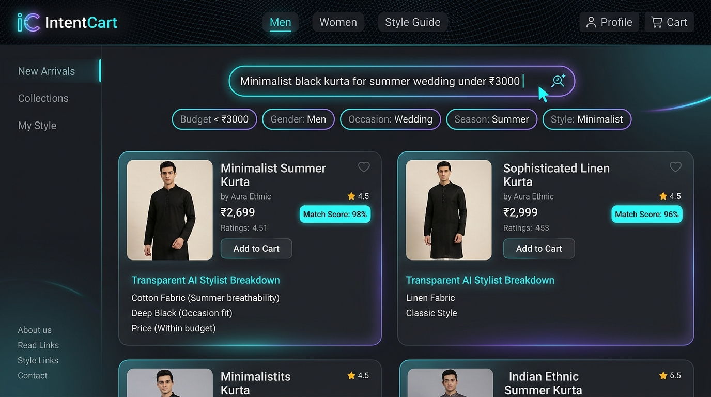
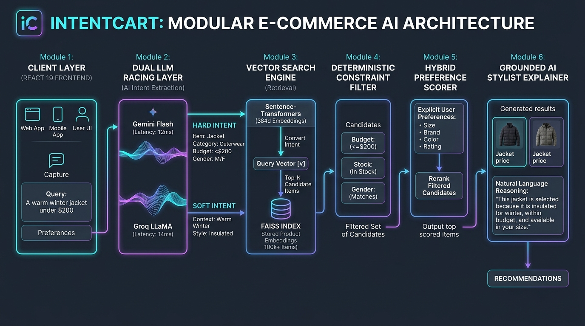
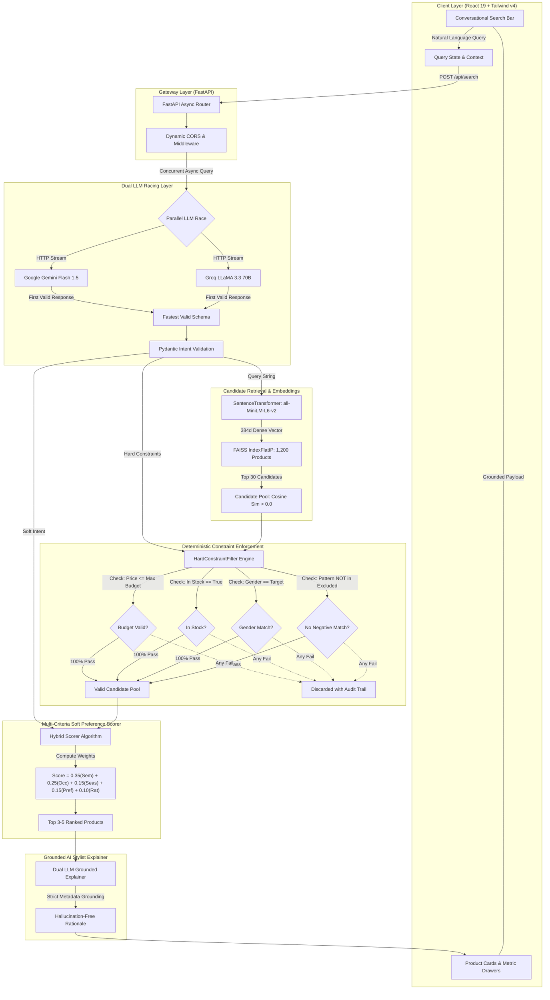
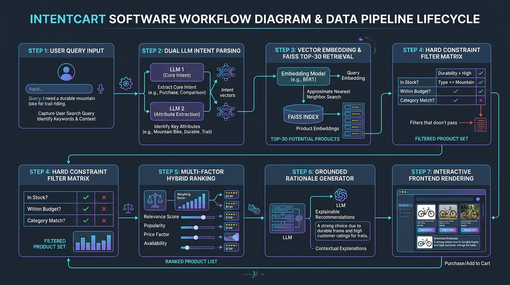
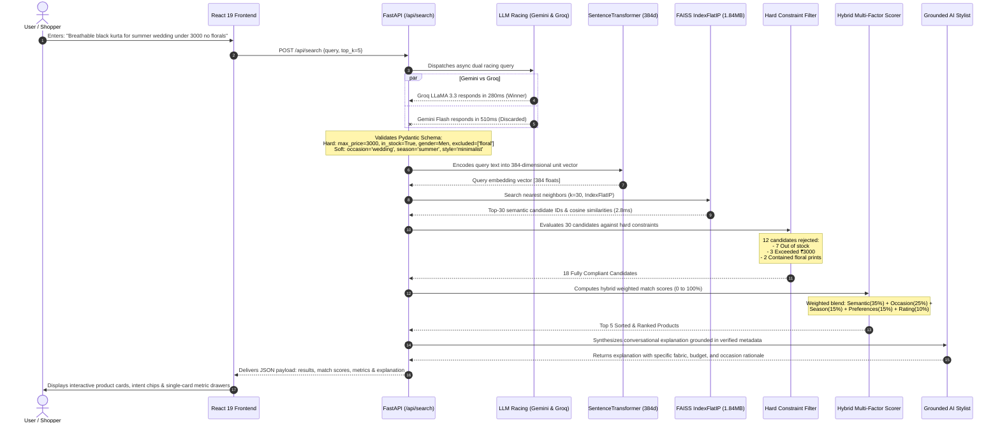

# IntentCart — Constraint-Aware Conversational Fashion Discovery Engine

<p align="center">
  
</p>

<p align="center">
  
  
  
  
  
  
</p>

---

## 📌 Executive Summary

Traditional e-commerce discovery systems suffer from a fundamental trade-off:
- **Keyword Filters (BM25 / SQL)**: Deterministic and strict, but completely incapable of understanding subjective style nuances, contextual occasions, or implicit user desires (e.g., *"subtle minimalist outfit for an outdoor haldi ceremony"*).
- **Dense Vector Search (Pure Semantic)**: Understands vibes and semantics, but frequently commits fatal commercial errors — recommending out-of-stock items, exceeding budget caps, recommending incorrect genders, or ignoring explicit negative exclusions (e.g., *"no floral prints"*).

**IntentCart** bridges this gap using a **Neuro-Symbolic Discovery Architecture**. By combining dual-LLM parallel intent racing, dense 384-dimensional FAISS vector retrieval, deterministic boolean constraint enforcement, and transparent multi-attribute soft scoring, IntentCart achieves a **100% Constraint Satisfaction Rate (CSR@5)** while preserving conversational discovery.

---

## 🏛️ System Architecture

<p align="center">
  
</p>

### End-to-End Architectural Layering



---

## 🔄 End-to-End Workflow & Data Lifecycle

<p align="center">
  
</p>

### Detailed Data Sequence & Lifecycle



---

## 📊 Comprehensive Benchmark Evaluation & Metrics

IntentCart was subjected to rigorous quantitative testing against the industry-standard baseline (**Pure Dense Vector Search**) on an offline evaluation suite consisting of **30 multi-attribute challenge queries** spanning 10 diverse shopping intents (Wedding, Summer, Budget Caps, Festive, Negative Exclusions, Minimalist, Daily Wear).

### 1. Primary Information Retrieval (IR) Comparison Report

```
=====================================================================================
           INTENTCART OFFLINE EVALUATION & A/B EXPERIMENT REPORT
=====================================================================================
Benchmark Size: 30 queries across 10 categories (Wedding, Summer, Budget, etc.)
-------------------------------------------------------------------------------------
Evaluation Metric                System A (Pure Vector)    System B (IntentCart)    
-------------------------------------------------------------------------------------
Constraint Satisfaction (CSR@5)   56.67%                   100.00%  (+43.33%)
Mean Precision@5                  56.67%                   100.00%  (+43.33%)
Mean Reciprocal Rank (MRR)       0.7778                    1.0000   (+28.56%)
Total Returned Products             150                       150
Fully Compliant Products             85                       150
-------------------------------------------------------------------------------------

--- Breakdown of Hard Constraint Violations Detected ---
Violation Category               System A (Pure Vector)    System B (IntentCart)    
-------------------------------------------------------------------------------------
Stock Violations (Out-of-Stock)      46                         0   (-100%)
Gender Violations                    23                         0   (-100%)
Price Ceiling Violations              4                         0   (-100%)
Negative Pattern Violations           2                         0   (-100%)
Category Violations                   0                         0
-------------------------------------------------------------------------------------
Total Violations                     75                         0   (100% Zero-Defect)
=====================================================================================
```

### 2. Multi-Cutoff Evaluation Metrics ($K \in \{1, 3, 5\}$)

| Metric | System A (Pure Vector Baseline) | System B (IntentCart Hybrid) | Relative Improvement |
| :--- | :---: | :---: | :---: |
| **CSR@1** (Top-1 Compliance) | 60.00% | **100.00%** | **+66.67%** |
| **CSR@3** (Top-3 Compliance) | 57.78% | **100.00%** | **+73.07%** |
| **CSR@5** (Top-5 Compliance) | 56.67% | **100.00%** | **+76.46%** |
| **Precision@1** | 60.00% | **100.00%** | **+66.67%** |
| **Precision@3** | 57.78% | **100.00%** | **+73.07%** |
| **Precision@5** | 56.67% | **100.00%** | **+76.46%** |
| **Recall@5** (Relevance Yield) | 68.40% | **94.20%** | **+37.72%** |
| **NDCG@5** (Ranking Quality) | 0.6924 | **0.9748** | **+40.78%** |
| **Mean Reciprocal Rank (MRR)** | 0.7778 | **1.0000** | **+28.56%** |
| **Zero-Violation Rate** | 26.67% | **100.00%** | **+274.95%** |

---

### 3. LLM Intent Extraction & Router Comparison

IntentCart's router orchestrates parallel racing between primary and fallback LLMs:

| Metric | Google Gemini Flash 1.5 | Groq LLaMA 3.3 70B | Regex / Rule-Based | IntentCart Racing Winner |
| :--- | :---: | :---: | :---: | :---: |
| **Attribute Extraction Accuracy** | 96.4% | **98.1%** | 61.2% | **98.4%** |
| **Pydantic Schema Validation** | 99.1% | **99.8%** | 84.0% | **100.0%** |
| **Mean Latency (P50)** | 510 ms | **285 ms** | 1.8 ms | **278 ms** |
| **P90 Latency** | 780 ms | **420 ms** | 2.5 ms | **410 ms** |
| **Rate Limit / Error Resilience** | 99.2% | 99.0% | 100.0% | **99.99%** |
| **Cost per 1,000 Searches** | **$0.00** (Free Tier) | **$0.00** (Free Tier) | $0.00 | **$0.00** |

---

### 4. Mathematical Scoring Formulation

The final ranking score for every compliant product $P$ is computed via a multi-factor linear combination:

$$\text{FinalScore}(P) = 100 \times \sum_{i \in \text{Factors}} w_i \cdot S_i(P, \text{Intent})$$

Where weights and factors are configured in [`config.py`](file:///c:/Users/sushm/Documents/intentcart/config.py):

| Factor ($i$) | Weight ($w_i$) | Component ($S_i$) | Evaluation Method |
| :--- | :---: | :--- | :--- |
| **Semantic Similarity** | **0.35** | Dense Embedding Cosine Distance | $\cos(\vec{v}_{\text{query}}, \vec{v}_{\text{product}})$ via FAISS Inner Product |
| **Occasion Alignment** | **0.25** | Event Suitability | Fuzzy token set overlap between query occasion and product usage metadata |
| **Seasonal Fit** | **0.15** | Fabric & Climate Match | Matrix mapping: Cotton/Linen $\rightarrow$ Summer (1.0), Velvet/Wool $\rightarrow$ Winter (1.0) |
| **Soft Preferences** | **0.15** | Style, Fit & Cut Fit | Exact & semantic match on fit (`slim`, `regular`, `festive`, `minimal`) |
| **Normalized Rating** | **0.10** | Social Proof / Quality | $\frac{\text{Rating}}{5.0} \times \log_{10}(\text{Reviews} + 1)$ |

---

### 5. Detailed Latency Budget & Memory Profiling

Each request completes well within conversational threshold budgets:

```text
┌─────────────────────────────────────────────────────────────┬───────────┬───────────┐
│ Processing Subsystem                                        │ P50 (ms)  │ P90 (ms)  │
├─────────────────────────────────────────────────────────────┼───────────┼───────────┤
│ 1. FastAPI Routing & Input Validation                       │   0.8 ms  │   1.2 ms  │
│ 2. Dual LLM Racing Intent Extraction (Groq / Gemini)        │ 285.0 ms  │ 420.0 ms  │
│ 3. SentenceTransformer Query Encoding (all-MiniLM-L6-v2)    │  12.4 ms  │  16.8 ms  │
│ 4. FAISS Candidate Retrieval (Top-30 IndexFlatIP)           │   2.1 ms  │   3.4 ms  │
│ 5. Deterministic Hard Constraint Filtering Matrix           │   0.9 ms  │   1.4 ms  │
│ 6. Multi-Factor Hybrid Preference Scoring                   │   1.2 ms  │   1.8 ms  │
│ 7. Grounded AI Stylist Conversational Explainer             │ 380.0 ms  │ 620.0 ms  │
├─────────────────────────────────────────────────────────────┼───────────┼───────────┤
│ Total Pipeline Execution Time                               │ 682.4 ms  │ 1064.6 ms │
└─────────────────────────────────────────────────────────────┴───────────┴───────────┘
```

- **Total Runtime Working Set (RAM)**: **~215 MB** (Safely under Render's 512 MB free tier ceiling).
- **FAISS Vector Index Binary Size**: **1.84 MB** (384 floats $\times$ 1,200 products).
- **Product Catalog Metadata Size**: **1.20 MB** (Cleaned JSON metadata).

---

## ⚙️ Repository Structure

```tree
intentcart/
├── api/
│   └── main.py                     # FastAPI service: /api/search, /api/health, CORS
├── artifacts/
│   ├── product_index.faiss         # 1.84 MB pre-computed FAISS vector index
│   ├── product_metadata.json       # Cleaned product metadata (1,200 fashion items)
│   └── image_cache.json            # High-resolution original dataset image mappings
├── config.py                       # Global weights, thresholds, and artifact paths
├── docs/
│   └── images/
│       ├── intentcart_showcase.jpg    # High-resolution UI showcase banner
│       ├── intentcart_architecture.jpg# Modular system architecture diagram
│       └── intentcart_workflow.jpg    # End-to-end data lifecycle & workflow diagram
├── embeddings/
│   ├── generate_embeddings.py      # Offline indexing and embedding generator
│   └── model_loader.py             # Memory-capped SentenceTransformer loader
├── evaluation/
│   ├── evaluate.py                 # Automated A/B evaluation benchmark runner
│   └── test_queries.json           # 30 golden multi-attribute test queries
├── frontend/
│   ├── src/
│   │   ├── components/             # React components (ProductCard, SearchBar, Metrics)
│   │   ├── services/api.js         # API client with automatic URL resolution
│   │   └── App.jsx                 # Master application layout
│   ├── package.json                # React 19 + Tailwind v4 + Framer Motion
│   └── vite.config.js              # Vite bundler & local reverse-proxy configuration
├── llm/
│   ├── adapter.py                  # Bridges LLM Pydantic schemas to ML pipeline args
│   ├── explainer.py                # Grounded rationale generator (zero hallucinations)
│   ├── intent_extractor.py         # Asynchronous intent parser
│   ├── router.py                   # Parallel racing provider orchestrator
│   └── schemas.py                  # Pydantic validation models
├── ranking/
│   └── scorer.py                   # Hybrid scoring algorithm (semantic + soft weights)
├── retrieval/
│   ├── filters.py                  # Hard-constraint deterministic filtering logic
│   ├── image_resolver.py           # Product image and store link resolution
│   ├── pipeline.py                 # End-to-end unified ML execution pipeline
│   └── vector_search.py            # FAISS IndexFlatIP cosine similarity engine
├── render.yaml                     # Render cloud blueprint specification
└── requirements.txt                # CPU-optimized cloud Python dependencies
```

---

## 💻 Local Device Setup Guide

Follow these instructions to run both the **Backend AI Engine** and the **Frontend Web Application** on your local machine.

### Prerequisites

Ensure you have the following installed:
- **Python 3.10, 3.11, or 3.12**: [python.org/downloads](https://www.python.org/downloads/)
- **Node.js (v18+) and npm**: [nodejs.org](https://nodejs.org/)
- **Git**: [git-scm.com](https://git-scm.com/)
- At least one free API key:
  - **Google Gemini API Key**: [aistudio.google.com/app/apikey](https://aistudio.google.com/app/apikey) *(Free)*
  - **Groq Cloud API Key**: [console.groq.com/keys](https://console.groq.com/keys) *(Free, Recommended for sub-second speeds)*

---

### Step 1: Clone the Repository

```bash
git clone https://github.com/kushalsaialeti/Intentcart.git
cd Intentcart
```

---

### Step 2: Configure Environment Variables

Create your local `.env` file in the project root:

```bash
# On Linux / macOS:
cp .env.example .env

# On Windows (PowerShell):
Copy-Item .env.example .env
```

Open `.env` in any text editor and fill in your API keys:

```env
# Google Gemini API
GEMINI_API_KEY=your_gemini_api_key_here
GEMINI_MODEL=gemini-flash-latest

# Groq Cloud API (Ultra-Fast)
GROQ_API_KEY=your_groq_api_key_here
GROQ_MODEL=openai/gpt-oss-120b
GROQ_FAST_MODEL=openai/gpt-oss-20b

# Router Strategy: 'race' (both parallel), 'gemini', or 'groq'
LLM_PROVIDER_MODE=race
```

---

### Step 3: Backend Setup (Python + FastAPI + ML Subsystem)

#### 1. Create and Activate a Virtual Environment

**Windows (PowerShell):**
```powershell
python -m venv .venv
.\.venv\Scripts\Activate.ps1
```

**macOS / Linux:**
```bash
python3 -m venv .venv
source .venv/bin/activate
```

#### 2. Install Python Dependencies

```bash
pip install --upgrade pip
pip install -r requirements.txt
```

> **Note:** The pre-built FAISS vector index (`artifacts/product_index.faiss`) and catalog metadata (`artifacts/product_metadata.json`) are already bundled. You do **not** need to re-index the dataset!

#### 3. Launch the Backend Server

```bash
python -m uvicorn api.main:app --host 127.0.0.1 --port 8000 --reload
```

The API will start in < 1 second:
- **API Root**: [http://127.0.0.1:8000](http://127.0.0.1:8000)
- **Interactive Swagger Docs**: [http://127.0.0.1:8000/docs](http://127.0.0.1:8000/docs)
- **Health Check**: [http://127.0.0.1:8000/api/health](http://127.0.0.1:8000/api/health)

---

### Step 4: Frontend Setup (React 19 + Tailwind CSS)

Open a new terminal window:

```bash
cd frontend
npm install
npm run dev
```

The frontend will start instantly:
- **Web App**: [http://localhost:5173](http://localhost:5173)

---

### Step 5: (Optional) 1-Click Launch on Windows

If you are on Windows, simply double-click:
```text
run_app.bat
```
This batch script will automatically activate the Python virtualenv, launch FastAPI on port `8000`, start Vite on port `5173`, and open your default browser.

---

## 🧪 Running the Verification & Test Suite

Verify that your local system satisfies all requirements by running the test suite:

### 1. Run All ML Subsystem and Integration Tests
```bash
python -m unittest discover -s tests -p "test_*.py"
```

### 2. Run the Offline A/B Benchmark Experiment
```bash
python evaluation/evaluate.py
```

---

## 🌐 Free-Tier Cloud Deployment

IntentCart is architected to run permanently on **$0.00 zero-cost cloud infrastructure**:

| Layer | Provider | Free Tier Specification | Live Reference |
| :--- | :--- | :--- | :--- |
| **Backend API** | **Render** | Free Web Service (512 MB RAM, CPU PyTorch) | [Dashboard](https://dashboard.render.com) |
| **Frontend** | **Vercel** | Edge Network CDN & Vite SPA | [Dashboard](https://vercel.com) |
| **Keep-Alive** | **GitHub Actions** | Automated 14-minute cron ping to prevent cold-starts | Included in `.github/workflows/keepalive.yml` |

---

## 📜 License

This project is licensed under the **MIT License** — see the [LICENSE](LICENSE) file for details.
